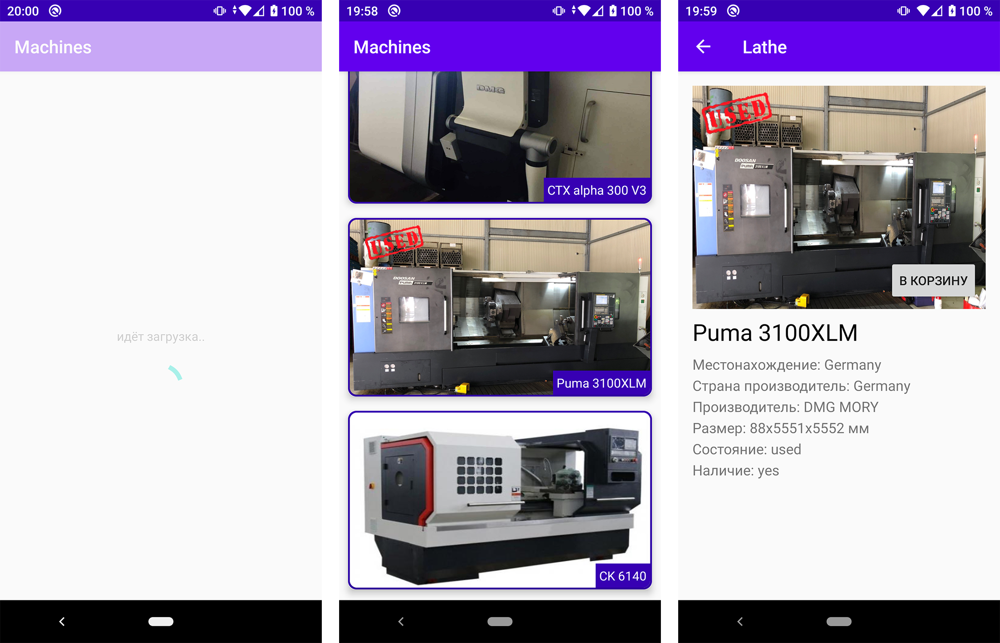

Machines

========

Приложение сделано согласно тестового задания.

Description
------------

Продоставлена ссылка на данные: [Ссылка](http://q11.jvmhost.net/lathe_json).
Нужно получить данные и вывести список станков, при нажатии на станок
требуется, чтобы раскрывались подробные характеристики(пяти характеристик  
достаточно).  
Видео с работой приложения залить на YouTube и отправить ссылку. [Видео](https://youtu.be/iNsmQMaLsIA)

Preview
-------

Contact
-------
tel: +7 (911) 395-34-25  
telegram: [@il_osipov](https://t.me/il_osipov)  
e-mail: il.osipov.gm@gmail.com